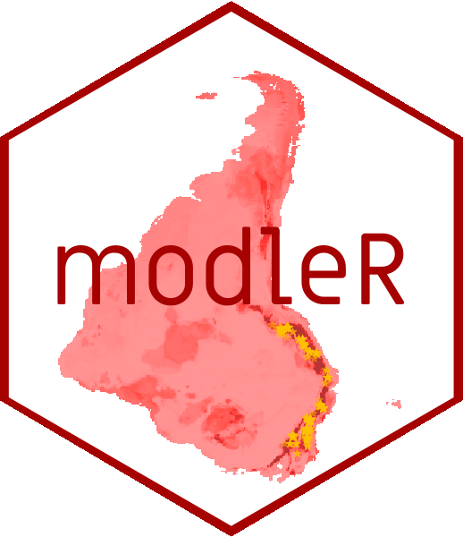

```{r setup, include=FALSE}
knitr::opts_chunk$set(echo = FALSE)
options(htmltools.dir.version = FALSE)
library(xaringanthemer)

style_duo_accent(
  primary_color = "#562457",
  colors = c(
    red = "#A70000",
    purple = "#88398a",
    orange = "#ff8811",
    green = "#136f63",
    white = "#FFFFFF",
    black = "#181818"
  ),
  text_bold_color = "#181818",
  header_font_google = google_font("Roboto Condensed"),
  text_font_google = google_font("Roboto Condensed", "300", "300i"),
  code_font_google = google_font("Ubuntu Mono"), text_font_size = "30px"
)
```

background-image: url(https://raw.githubusercontent.com/rladies/starter-kit/master/stickers/rainbow.png)
background-position: top right
background-size: 110px 120px
layout: true

---
background-image: url(figs/modleR.png)
background-position: 80% 55%

## sobre

- bióloga, usuária de R desde 2009
- trabalho com reprodutibilidade em Ecologia, modelagem estatística e estudos de biodiversidade
- uma das desenvolvedoras do pacote [__.red[modler]__](https://model-r.github.io/modleR/]modleR), liderado por __Andrea Sánchez-Tapia__


```{r, opt.width = .1, fig.align="right"}
#
```

- [**.red[liibre]**](https://liibre.github.io/coronabr/about.html)
- [**Observatório COVID-19 BR**](https://covid19br.github.io/)
- [**.purple[@RLadiesRio]**](https://twitter.com/RLadiesRio)


---
class:toc
## sobre hoje

1. __por que reprodutibilidade?__

2. __usando R de forma reprodutível__

3. __perdendo o medo de git__

4. __um exemplo com o pacote coronabr__

---
class: center, middle, toc
# __por que reprodutibilidade?__

---
## motivos para reprodutibilidade

- por você no futuro

--
- por colegas

--
- evidências de que seus resultados estão corretos

--
- permitir que outres usem seus métodos e resultados

---
class: middle, center


---
## passos para reprodutibilidade

+ priorizar ferramentas baseadas em _scripts_ como `R`
--

+ usar sistemas de __controle de versões__ como `git`
--

+ documentar bem todos os passos e decisões
--

+ publicar os protocolos e o código
--

+ fomentar a revisão de metodologia e do código entre pares


---
background-image: url(figs/r_data_science.jpg)
background-size: 150px 180px
background-position: 85% 80%

## por que R?

- script é essencial para reprodutibilidade, mas não a garante 
--

- __código aberto__, __livre__ & __sem custo__
--

- acessível (em comparação a outras linguagens de programação)
--

- muito comum na Biologia, Ciência de Dados e em diversas áreas
--

---
## por que git?

- __controle de versão__
--

- permite acompanhar o histórico do desenvolvimento
--

- facilita o trabalho colaborativo
--

- facilita o compartilhamento de todas as etapas do trabalho

---
class: center, middle
# __usando R de forma reprodutível__

---
## estrutura de pastas

__nomes__ e __caminhos__ são essenciais para o trabalho reprodutível!


```
    .
    ├── codigo/               # Scripts em R
    ├── dados/                # Dados brutos
    ├── output/               # Outputs gerados a partir dos códigos
    ├── figs/                 # Figuras geradas a partir dos códigos
    ├── docs/                 # Relatórios reprodutíveis produzidos a partir dos outputs
    ├── *.Rproj               # Projeto de RStudio
    ├── .gitignore            # Lista dos arquivos e/ou pastas que não serão controlados
    └── README.md             # Documentação -> Leia e escreva sempre que possível ;)
```


---
background-image: url(figs/jenny_bryan.jpeg)
background-size: 220px 240px
background-position: 85% 50%

## usando projetos de RStudio
esqueça `set.wd()` e conheça [Jenny Bryan](https://www.tidyverse.org/blog/2017/12/workflow-vs-script/)


---
# .Rproj define o wd


---
class: center, middle
# __perdendo o medo de git__


---
class: center, middle
# __um exemplo com o pacote coronabr__

---
layout:false

## o pacote [.red[coronabr]](https://liibre.github.io/coronabr/) 

```{r}
knitr::include_graphics("figs/coronabr.png")
```

---

## responsabilidade com dados

- dados deveriam ser abertos e acessíveis
  
  [Trânsparência COVID-19 OPEN KNOWLEDGE BRASIL](https://transparenciacovid19.ok.org.br)
- nem toda análise que **pode** ser feita, **deve** ser feita 
- cada dado diz respeito a uma pessoa
- para COVID-19 e SRAG: **subnotificação** & **atraso**
- inconsistência com dados reportados em diferentes escalas: município, estado, país (no [Rio de Janeiro](https://g1.globo.com/rj/rio-de-janeiro/noticia/2020/05/26/prefeitura-muda-metodo-e-rio-registra-menos-1177-obitos-por-covid-19.ghtml))

---
## dados brutos


---
## dados com correção pelo atraso de notificação

---

background-image: url(https://raw.githubusercontent.com/rladies/starter-kit/master/stickers/rainbow.png)
background-position: 80% 80%
background-size: 220px 240px

class: center, middle
# __.purple[obrigada!]__
