```{r setup, include=FALSE}
knitr::opts_chunk$set(echo = FALSE)
options(htmltools.dir.version = FALSE)
library(xaringanthemer)

style_duo_accent(
  primary_color = "#562457",
  colors = c(
    red = "#A70000",
    purple = "#88398a",
    orange = "#ff8811",
    green = "#136f63",
    white = "#FFFFFF",
    black = "#181818"
  ),
  text_bold_color = "#181818",
  header_font_google = google_font("Roboto Condensed"),
  text_font_google = google_font("Roboto Condensed", "300", "300i"),
  code_font_google = google_font("Ubuntu Mono"), text_font_size = "30px"
)
```

background-image: url(https://raw.githubusercontent.com/rladies/starter-kit/master/stickers/rainbow.png)
background-position: top right
background-size: 110px 120px
layout: true

---
background-image: url(figs/modleR.png)
background-position: 80% 65%

## sobre

- bióloga, usuária de R desde 2009

- trabalho com reprodutibilidade em Ecologia, modelagem estatística e estudos de biodiversidade

- uma das desenvolvedoras do pacote [__.red[modler]__](https://model-r.github.io/modleR/]modleR), liderado por __Andrea Sánchez-Tapia__


- [**.red[liibre]**](https://liibre.github.io/coronabr/about.html)

- [**Observatório COVID-19 BR**](https://covid19br.github.io/)

- [**.purple[@RLadiesRio]**](https://twitter.com/RLadiesRio)


---
## sobre hoje

__1. por que reprodutibilidade?__


__2. usando R de forma reprodutível__


__3. perdendo o medo de git__


__4. um fluxo reprodutível com o pacote coronabr__

---
class: center, middle, toc
# __1. por que reprodutibilidade?__

---
## motivos para reprodutibilidade

- por você no futuro
--


- por colegas
--


- evidências de que seus resultados estão corretos
--


- permitir que outres usem seus métodos e resultados

---
class: middle, center

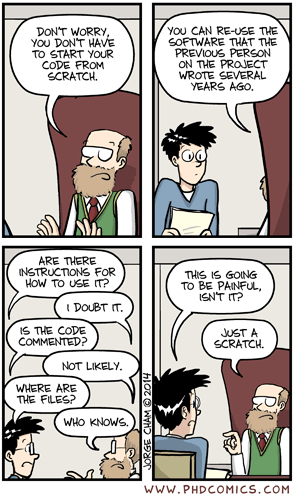

---
## passos para reprodutibilidade

+ priorizar ferramentas baseadas em _scripts_ como `R`
--


+ usar sistemas de __controle de versões__ como `git`
--


+ documentar bem todos os passos e decisões
--


+ publicar os protocolos e o código
--


+ fomentar a revisão de metodologia e do código entre pares


---
background-image: url(figs/r_data_science.jpg)
background-size: 150px 180px
background-position: 85% 90%

## por que R?

- script é essencial para reprodutibilidade, mas não a garante 
--


- __código aberto__, __livre__ & __sem custo__
--


- acessível (em comparação a outras linguagens de programação)
--


- muito comum na Biologia, Ciência de Dados e em diversas áreas
--

---
## por que git?

- __controle de versão__
--


- permite acompanhar o histórico do desenvolvimento
--


- facilita o trabalho colaborativo
--


- facilita o compartilhamento de todas as etapas do trabalho

---
class: center, middle
# __2. usando R de forma reprodutível__

---
## estrutura de pastas

__nomes__ e __caminhos__ são essenciais para o trabalho reprodutível!


```
    .
    ├── codigo/               # Scripts em R
    ├── dados/                # Dados brutos
    ├── output/               # Outputs gerados a partir dos códigos
    ├── figs/                 # Figuras geradas a partir dos códigos
    ├── docs/                 # Relatórios reprodutíveis produzidos a partir dos outputs
    ├── *.Rproj               # Projeto de RStudio
    ├── .gitignore            # Lista dos arquivos e/ou pastas que não serão controlados
    └── README.md             # Documentação -> Leia e escreva sempre que possível ;)
```


---
background-image: url(figs/jenny_bryan.jpeg)
background-size: 220px 240px
background-position: 85% 50%

## usando projetos de RStudio
esqueça `setwd()` e conheça [Jenny Bryan](https://www.tidyverse.org/blog/2017/12/workflow-vs-script/)

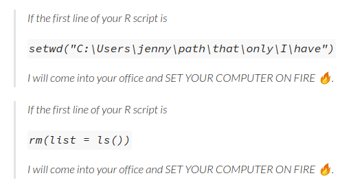

---
# .Rproj define o wd

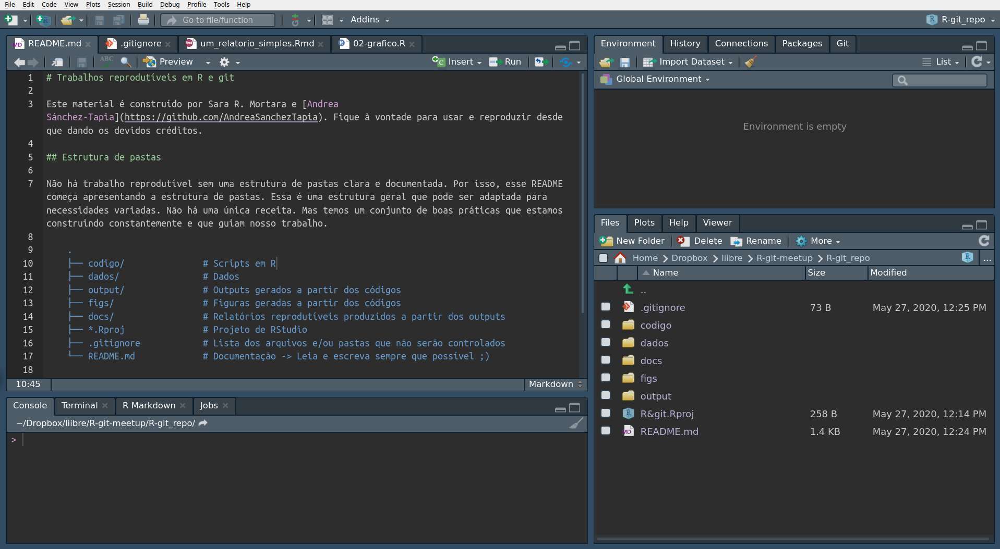


---
class: center, middle
# __3. perdendo o medo de git__


---
## __git__ é o sistema de controle de versão

+ registra mudanças ao longo do tempo
--


+ volta atrás se houver algum erro
--


+ entende a diferença entre uma versão e outra do mesmo arquivo
--


+ facilita colaboração: __compartilhar__ as análises e __trabalhar em equipe__ 

---
## hospedagem web para repositórios git

```{r out.width='15%'}
knitr::include_graphics("figs/GitHub_Logo.png")
knitr::include_graphics("figs/gitlab-logo-gray-rgb.png")
knitr::include_graphics("figs/btibucket.png")
```

+ ___remotes___
--

+ controla detalhadamente o conteúdo de __arquivos de texto__: `.txt`, `.csv`, `.md`, `.R`, `.tex`, `.Rmd`
--

+ pode incluir outro tipo de arquivos (binários)
--

+ o usuário decide __quais arquivos__ incluir
--

+ serve __localmente__ e __offline__
--

+ se comunica com __servidores remotos__ que servem de _backup_ e para distribuir (colaboração)


---
## quatro estados

 trabalho > __mudanças__ >  __salvar uma versão__ > __mandar as versões para o remoto__


+ _working directory_: arquivo adicionado para ser monitorado -> avisa quando for modificado
--


+ _staging area_: `add` arquivos/mudanças adicionadas
--


+ `commit`: cria uma versão com os arquivos adicionados
--


+ `push`: manda para o remoto os commits que ainda não tiverem sido enviados


__vários arquivos por _commit_, vários _commits_ por _push___

---
## fluxo básico de trabalho 

sem ramificações

```{r, echo=F}

```

---
## comandos básicos de `git`

`git clone URL` clona um repositório já existente

--

`git status` checa em que pé está

--

`git pull origin master` atualiza o repo localmente

--

`git add filename` adiciona um arquivo novo ou mudanças a arquivos monitorados

--

`git commit -m "uma mensagem informativa"` __cria uma versão__

--

`git push origin master` atualiza o repositório remoto

---
## .Rproj + git = <3

```{r}
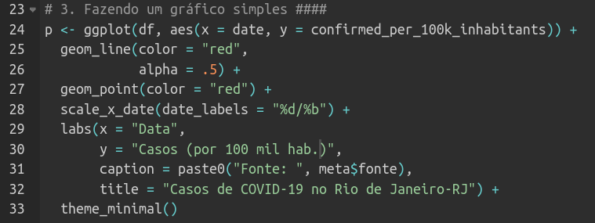
```

---
## .Rproj + git = <3

```{r}
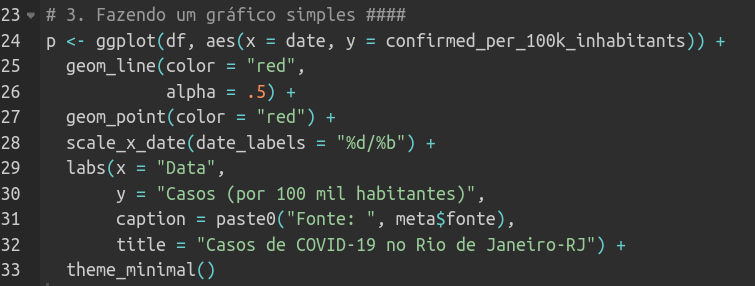
```


---
## .Rproj + git = <3

```{r}
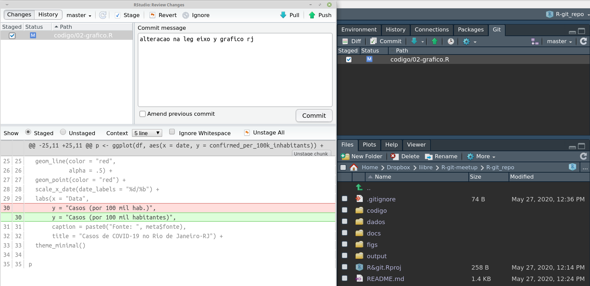
```


---
## .Rproj + git = <3

```{r}
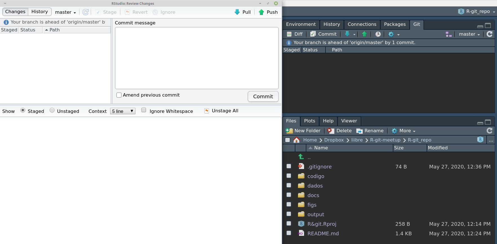
```


---
## R + git = <3  


`git pull origin master`
--


`git add codigo/02-grafico.R`
--


`git commit -m "alteracao na leg eixo y grafico rj"`
--


`git push origin master`
--

---
## o que você precisa

1. não ter medo
--


2. ter uma conta de github | gitlab | bitbucket
--


3. instalar git no seu computador
--

3. configurar uma chave ssh no serviço remoto e no seu computador local
   
   ([aula](https://gitlab.com/liibre/curso/-/wikis/uploads/b69f3377b9607dc668c948c7a479253e/aula03_git.pdf) e [tutorial](https://rpubs.com/andreasancheztapia/574156))
--


4. aprender errando
--


5. seja sincere, não tente mudar a história, permita-se errar e recomeçar

---
class: center, middle
# __4. um fluxo reprodutível com o pacote coronabr__
https://github.com/saramortara/R-git-tutorial

---
layout:false

## o pacote [.red[coronabr]](https://liibre.github.io/coronabr/) 

```{r}
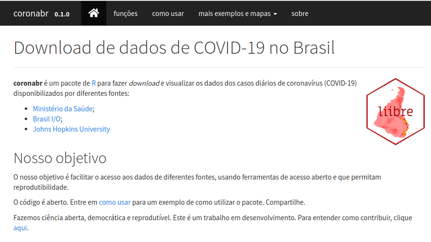
```

---

## responsabilidade com dados

- dados deveriam ser abertos e acessíveis
  
  [Trânsparência COVID-19 OPEN KNOWLEDGE BRASIL](https://transparenciacovid19.ok.org.br)
  
  
- nem toda análise que **pode** ser feita, **deve** ser feita 


- cada dado diz respeito a uma pessoa


- para COVID-19 e SRAG: **subnotificação** & **atraso**


- inconsistência com dados reportados em diferentes escalas: município, estado, país (no [Rio de Janeiro](https://g1.globo.com/rj/rio-de-janeiro/noticia/2020/05/26/prefeitura-muda-metodo-e-rio-registra-menos-1177-obitos-por-covid-19.ghtml))

---
## um repositório remoto com pastas :)

```{r}
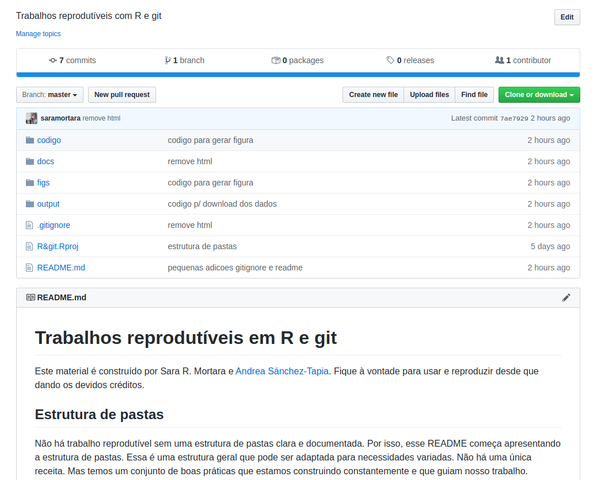
```

---
## o repositório local no R Studio :)

```{r}
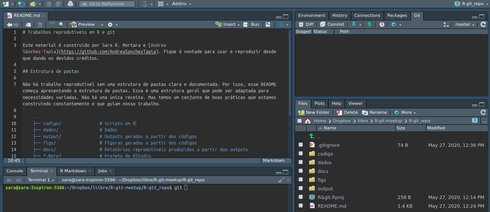
```

---
## a estrutura de pastas

```
    .
    ├── codigo/               
    |     ├── 01-download_dados.R
    |     ├── 02-grafico.R
    |     └── 03-nowcasting.R
    ├── dados/               
    |     ├── nowcasting_acumulado_covid_2020_05_18.csv
    |     ├── README.md
    ├── output/    
    |     ├── 01-rio_de_janeiro.csv
    |     └── metadado_corona_br.csv
    ├── figs/                 
    |     └── 02-rj_dados_brutos.png
    ├── docs/
    |     └── um_relatorio_simples.Rmd
    ...
```

---
class: center, middle
# .purple[rodando os códigos]


---
## 01-download_dados.R

```{r}
rj <- read.csv("../R-git_repo/output/01-rio_de_janeiro.csv")
```


```{r, eval = FALSE, echo = TRUE}
###########################################################################
# Script para download de dados de covid-19 no município do Rio de Janeiro
# por Sara Mortara, para rladiesrio
###########################################################################

# Para instalar o pacote use:
#remotes::install_github("liibre/coronabr")

# 1. bibliotecas ####
library(coronabr)

# 2. download ####
## dados rio de janeiro usando o geocode IBGE
rj <- get_corona_br(filename = "01-rio_de_janeiro",
                    ibge_cod = "3304557")

```

---
## 01-download_dados.R

```{r echo = TRUE}
# 3. inspeção dos dados ####
## checando os dados
head(rj)

## intervalo de tempo
range(rj$date)

## casos acumulados (inclui recuperados ~ 19 mil)
max(rj$confirmed)

## casos proporcional à populaççao
max(rj$confirmed_per_100k_inhabitants)

## obitos
max(rj$deaths)
```

---
## 01-download_dados.R

```{r echo = TRUE}
## intervalo de tempo
range(rj$date)

## casos acumulados (inclui recuperados ~ 19 mil)
max(rj$confirmed)

## casos proporcional à populaççao
max(rj$confirmed_per_100k_inhabitants)

## obitos
max(rj$deaths)
```

---
## [discrepância](https://g1.globo.com/rj/rio-de-janeiro/noticia/2020/05/26/prefeitura-muda-metodo-e-rio-registra-menos-1177-obitos-por-covid-19.ghtml) entre dado estadual e municipal!


---
## 02-grafico.R

```{r}
library(ggplot2)
df <- read.csv("../R-git_repo/output/01-rio_de_janeiro.csv")
meta <- read.csv("../R-git_repo/output/metadado_corona_br.csv")
```


```{r eval = FALSE, echo = TRUE}
####################################################
# Fazendo um gráfico simples para o município do RJ
# por Sara Mortara, para rladiesrio
####################################################

# 1. bibliotecas ###
library(ggplot2)

# 2. lendo e padronizando os dados ####
## data frame com os dados
df <- read.csv("output/01-rio_de_janeiro.csv")

## metadados
meta <- read.csv("output/metadado_corona_br.csv")
```

---
## 02-grafico.R

```{r echo = TRUE}
## metadados
meta
## convertendo coluna com data p/ classe Date
class(df$date)
df$date <- as.Date(df$date)
class(df$date)
```

---
## criando um gráfico com [ggplot2](https://ggplot2.tidyverse.org)

```{r}
p <- ggplot(df, aes(x = date, y = confirmed_per_100k_inhabitants)) +
  geom_line(color = "red",
            alpha = .5) +
  geom_point(color = "red") +
  scale_x_date(date_labels = "%d/%b") +
  labs(x = "Data",
       y = "Casos (por 100 mil habitantes)",
       caption = paste0("Fonte: ", meta$fonte),
       title = "Casos de COVID-19 no Rio de Janeiro-RJ") +
  theme_minimal()
```


```{r, echo = TRUE, eval = FALSE}
# 3. Fazendo um gráfico simples ####
p <- ggplot(df, aes(x = date, y = confirmed_per_100k_inhabitants)) +
  geom_line(color = "red",
            alpha = .5) +
  geom_point(color = "red") +
  scale_x_date(date_labels = "%d/%b") +
  labs(x = "Data",
       y = "Casos (por 100 mil habitantes)",
       caption = paste0("Fonte: ", meta$fonte),
       title = "Casos de COVID-19 no Rio de Janeiro-RJ") +
  theme_minimal()
```

---
## nosso gráfico

```{r, echo = TRUE, fig.align="center", fig.width = 6, fig.height  = 6}
p 
```


---
## exportando o gráfico

```{r eval = FALSE, echo = TRUE}
png("figs/02-rj_dados_brutos.png", res = 300,
    width = 1400, height = 1200)
p
dev.off()

```

```
    .
    ...
    ├── figs/                 
    |     └── 02-rj_dados_brutos.png
    ...
```

---
class: center, middle
# .purple[um alerta sobre os dados brutos de COVID-19]

---
## ressalvas em relação aos dados brutos

1. __subnotificação__
--


2. __atraso__ na entrada dos dados no sistema - tanto para casos como óbitos
--


---
## como vemos o atraso

```{r, out.width=500, fig.align="center"}
knitr::include_graphics("https://raw.githubusercontent.com/covid19br/covid19br.github.io/master/fig/obitos_tempo_mai14.gif")
```

---
## como corrigir o atraso com [nowcasting](https://github.com/covid19br/nowcasting)

```{r, out.width=500, fig.align="center"}
knitr::include_graphics("https://raw.githubusercontent.com/saramortara/R-git-tutorial/master/figs/03-rj_nowcasting.png")
```


---
## um relatório simples com Rmarkdown

- [Rmarkdown](https://rmarkdown.rstudio.com) :)
--


- embebe diretivas de formato em um documento de texto
--


- inspirado em $\LaTeX$ e Markdown
--


- um tutorial [aqui](https://rpubs.com/andreasancheztapia/574403)
--

---
## marcações de Rmarkdown

.pull-left[
`*italico*`

`**negrito**`

` `codigo` `
]

.pull-right[
*italico*

**negrito**

`codigo`]


---
## um exemplo com nosso trabalho

```{r}
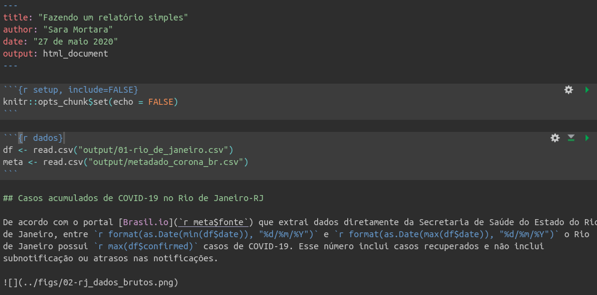
```

---
## um exemplo com nosso trabalho

```{r, out.height=500, out.width=450, fig.align="center"}
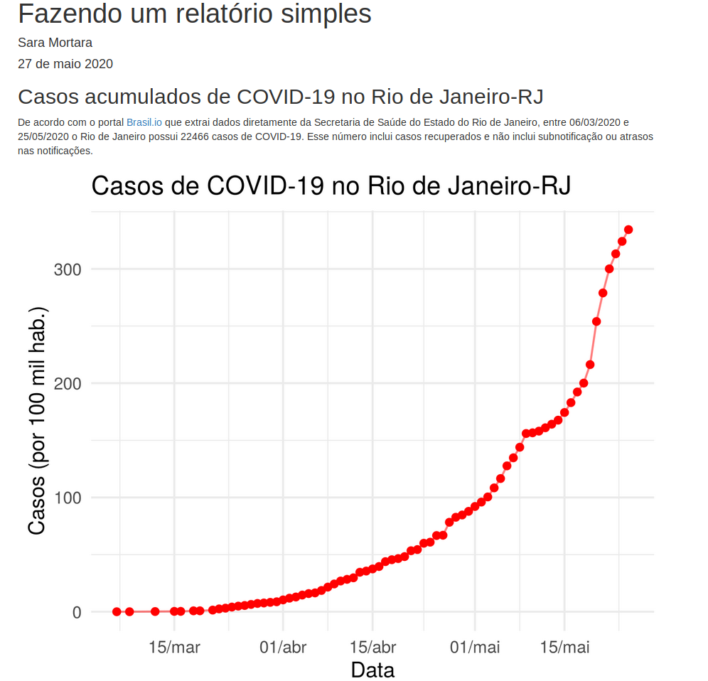
```


---
## kit básico de ferramentas: R, git, Rmarkdown


```{r, out.width=400, fig.align="center"}

```

---
## para saber mais

- [material curso liibre](https://gitlab.com/liibre/curso/-/wikis/material) 


- [Jenny Bryan - workflows](https://www.tidyverse.org/blog/2017/12/workflow-vs-script/)


- [Jenny Bryan - happy git with R](https://happygitwithr.com/)


- [Daniele Navarro - robust tools](https://robust-tools.djnavarro.net)


- [Page Piccinini - R & git setup](https://pagepiccinini.com/r-course/lesson-0-introduction-and-set-up/)

---

background-image: url(https://raw.githubusercontent.com/rladies/starter-kit/master/stickers/rainbow.png)
background-position: 80% 95%
background-size: 220px 240px

class: center, middle
# __.purple[obrigada!]__

[@MortaraSara](https://twitter.com/MortaraSara)  `r icon::fa("twitter")`


